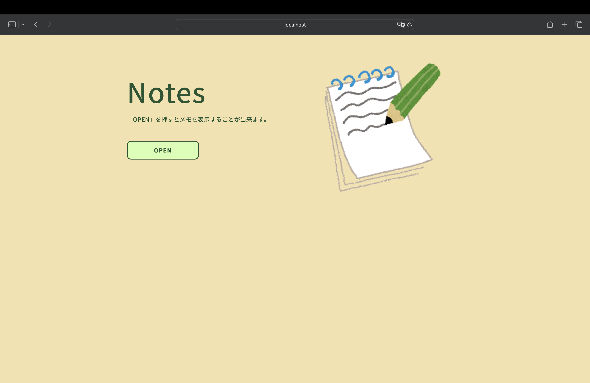
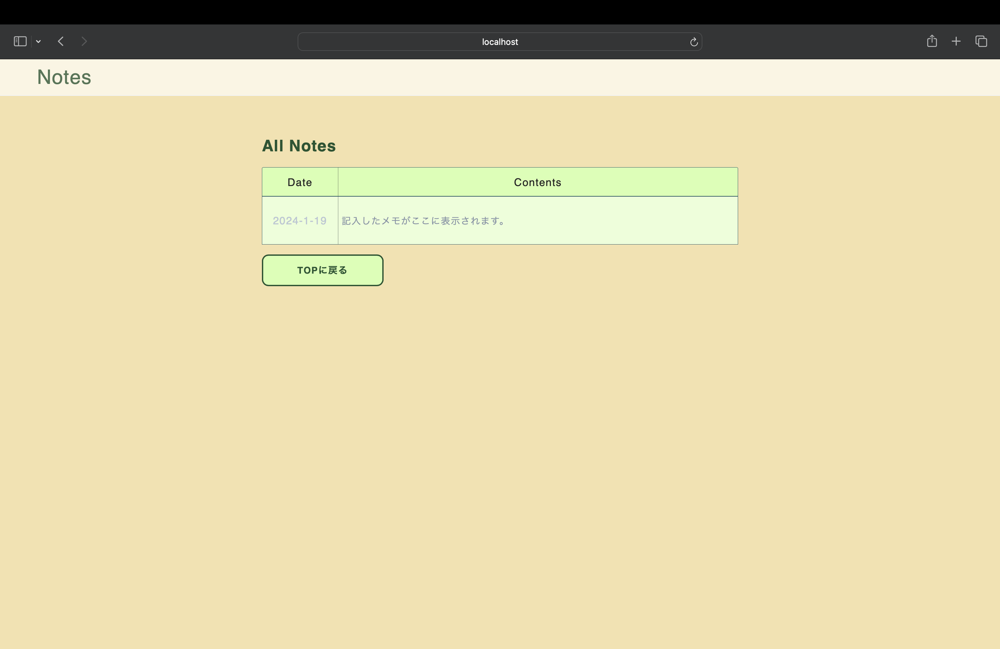

# Notes
"Notes"はブラウザ上でメモを見ることができるアプリケーションです。

## 機能
- /views/index.ejs 内にある定数 notes に書かれた内容を表示する

## 制作した目的
- Web上で見やすい「ふせん」のようなメモ帳を作成したいと思い、制作を始めた。
- 加えて、数ヶ月前から学び始めたHTML・CSS, JavaScript, node.js の応用も兼ねて制作。

## スクリーンショット

## 今後の方針
- 上記の「機能」で述べているように、メモの内容を直接ソースコードで編集する必要があるので、ウェブページ上で入力や削除ができるようにしたい。
- レスポンシブデザインに対応していないのでHTML・CSSの勉強と並行しながら改良していきたい。
- メモの内容をejsで記述するのではなく、データベースとして取り扱えるようにしたい。

